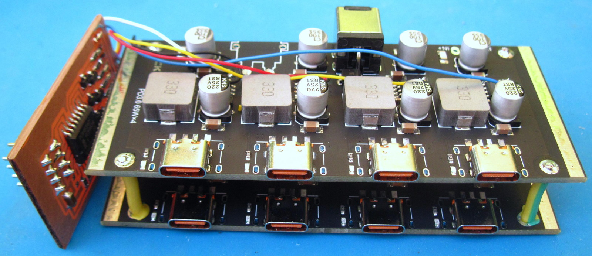
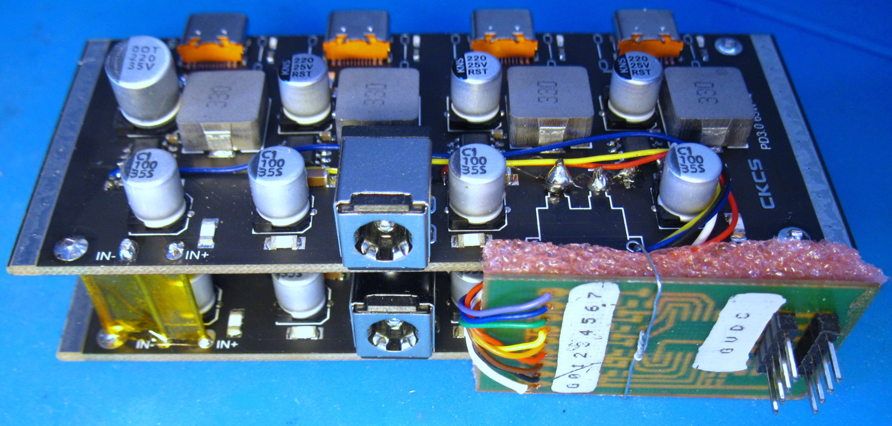

power-switch
============

This project consists in controlling multiple power outputs for various
devices. Some USB-PD multi-port controllers only require minor modifications
to support being controlled and deliver power to individual devices.

The PCA9554D based board under boards/pca9554d-v3 controls 8 individual
USB-PD channels over I2C.

The scripts/ directory contains a setup script, the "psw" script that's used to
list the ports states and change them, and a sample "psw.conf" config file to
map port numbers to GPIO numbers and descriptions.

Possible variations
===================

The project requires and open-drain output to control the CC1 line of
the USB-PD boards. Other devices such as 74HC596 or TPIC6B595 offer
open-drain variants of the ubiquitous 74HC595 that only requires 3
signals to control 8 lines (clock, data, register clock), and can
trivially be daisy-chained.
